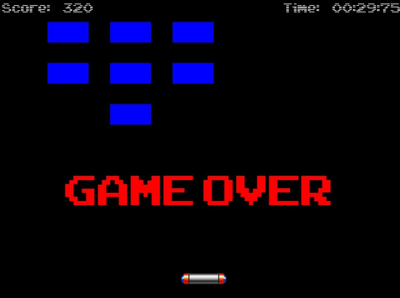

1. didn't add corners colision between ball and bricks yet.  
2. paddle movement not smooth. 
3. background images.  
---
  
  
  
  

---
link to UML source:
https://lucid.app/lucidchart/0052431a-265d-4142-986a-9b693329ce3b/edit?invitationId=inv_6593386f-f4f1-4e36-828b-0145fac3f756&page=HWEp-vi-RSFO#